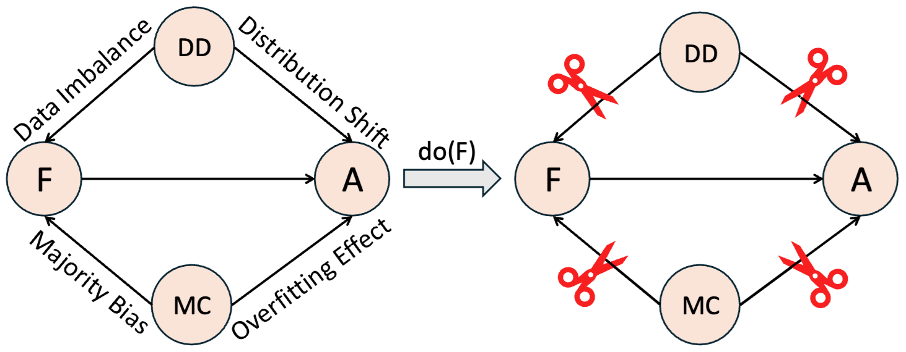
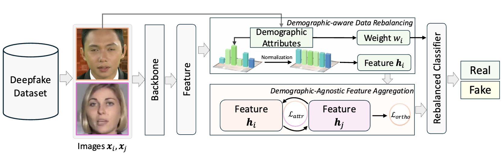

# Fair Deepfake Detector Can Generalize

This repository serves as the code implementation for our NeurIPS 2025 paper, “[Fair Deepfake Detector Can Generalize](https://openreview.net/pdf?id=p27bSdc3FS).” This work focuses on how to achieve a dual enhancement of fairness and generalizability for deepfake detectors.

# Motivation and Pipeline

The central objective of this research is to enhance model performance by establishing a direct causal relationship between **fairness** and **generalizability**. This is achieved by first constructing a Causal Graph to identify the critical confounders influencing both attributes, and subsequently controlling these identified factors.

Within our Causal Graph, we explicitly define two primary confounding variables: **DD (Data Distribution)** and **MC (Model Capacity)**.



NOTE: The proposed Causal Graph is not exhaustive, and the potential inclusion of additional confounding factors remains a subject for future investigation.



The proposed method therefore consists of two parts corresponding to the two confounding factors. For DD, we propose to regularize the dataset, penalizing the overly represented majority group. For MC, we forcibly control the model to output roughly similar features for samples from different groups but with the same label.

# Quick Start

### **NOTE**: The backbone of this code is [CADDM](https://github.com/megvii-research/CADDM), so it heavily borrows from the [CADDM repository](https://github.com/megvii-research/CADDM). Furthermore, it requires CADDM data preprocessing, such as landmark extraction and source image labeling. If CADDM is not available to you, you can consider our other repository, which uses EfficientNet as the backbone and achieved 2nd🥈 place in the NeurIPS 2025 AIFace Detection Challenge.

Our model can be directly applied to deepfake data, but if you need to calculate fairness metrics, your dataset needs to include demographic labels. In our work, we directly borrowed the datasets from the [previous work](https://github.com/Purdue-M2/Fairness-Generalization).

Once your dataset is ready, you can download the checkpoint from [Google Drive](https://drive.google.com/file/d/1obeawJUIBc0brvjUAThygnC469QOQp8c/view?usp=sharing) or [BaiduYunDisk](https://pan.baidu.com/s/1aY2G2fJt_ED55qhwWS8nLg?pwd=qxvj )

Then, you can simply run

```
python test.py --cfg ./configs/caddm_test.cfg
```

All the required settings is shown in caddy_test.cfg

You can also train the model with

```
python train.py --cfg ./configs/caddm_train.cfg
```

# Reference

If you find our work is useful, kindly cite it as:

```
@article{cheng2025fair,
  title={Fair Deepfake Detectors Can Generalize},
  author={Cheng, Harry and Liu, Ming-Hui and Guo, Yangyang and Wang, Tianyi and Nie, Liqiang and Kankanhalli, Mohan},
  journal={arXiv preprint arXiv:2507.02645},
  year={2025}
}
```

or

```
@inproceedings{cheng2025fair,
  title={Fair Deepfake Detectors Can Generalize},
  author={Cheng, Harry and Liu, Ming-Hui and Guo, Yangyang and Wang, Tianyi and Nie, Liqiang and Kankanhalli, Mohan},
  booktitle={NeurIPS},
  year={2025}
}
```

